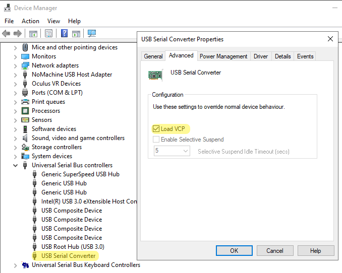
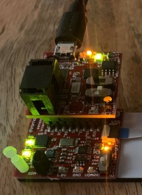
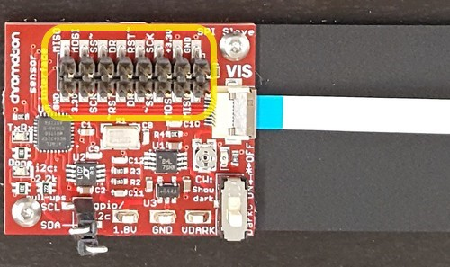

# Dev-kit interfaces

The Chromation dev-kit divides into **three interfaces**:

1. USB out
2. SPI out
3. Analog out


## USB out

*Chromation recommends using the USB interface for initial
evaluation and instrumentation.*

The dev-kit ships ready for USB connection to a computer.


### Windows users enable `Load VCP`

Windows users connecting the dev-kit for the first time:

- open Device Manager
- locate `USB Serial Converter`, right-click and select
  `Properties`
- on the `Advanced` tab, check the box to `Load VCP`



If `Load VCP` is *not checked*:

- the LabVIEW executable still runs
- but the Python API raises the following exception when it
  attempts to open communication with the dev-kit:

```python
MicroSpecConnectionException: Cannot find CHROMATION device
```

### Python and LabVIEW interfaces

Users communicate with the dev-kit using either:

- Python project `microspec` on PyPI -- *Windows, Mac, Linux*
    - <https://pypi.org/project/microspec>
    - jump to section [Interface dev-kit with microspec](#interface-dev-kit-with-microspec)
- LabVIEW GUI executable `dev-kit-2020-LabVIEW.exe` -- *Windows only*
    - <https://tinyurl.com/dev-kit-2020-labview>

Chromation recommends using Python to communicate with the
dev-kit. Chromation provides example scripts for using the API, a
command line interface for taking measurements, and a GUI
interface for taking measurements. In addition to the API,
project `microspec` includes tools to help developers interested
in modifying the API to run unit tests, emulate hardware, and
rebuild the documentation. All of Chromation's Python code is
available for free under the standard MIT license.

Chromation provides the LabVIEW GUI but plans to discontinue
using LabVIEW when a stable Python version of the GUI is
released.

## SPI out

The dev-kit has two stacked PCBs:



- the bottom PCB is `vis-spi-out`
    - `vis-spi-out` converts the spectrometer chip into a **SPI Slave**
- the top PCB is `usb-bridge`
    - `usb-bridge` converts the SPI interface to a **USB interface**

*The names `usb-bridge` and `vis-spi-out` are used in the PCB
design files and in the firmware respository.*

The connection between the `usb-bridge` and the `vis-spi-out` is
the **16-pin header**:



### Five-wire SPI

This 16-pin header carries the *five-wire* SPI interface.
Typicaly SPI interfaces only have four signals:

- Master-In Slave-Out (MISO)
- Master-Out Slave-In (MOSI)
- Slave Clock (SCK)
- Slave Select (SS)

The fifth SPI signal is **Data Ready** (DR). This is a Slave
output to indicate to the Master when data is ready. For example,
after the SPI Master commands the SPI Slave to capture a frame (a
spectrum measurement), the SPI Master waits for *Data Ready*
before reading the frame from the SPI Slave.

There are a total of eight signals on this 16-pin header. Five
signals are the SPI interface. The other three signals are Power
(3.3V and 0V) and Reset.

### All pins duplicated for probing

Each signal is duplicated: eight signals, 16 pins. This allows
the user to connect a signal with a jumper wire and
simultaneously probe the same signal on the duplicate pin.

This example shows five jumper wires for SPI and two jumper wires
for power, connecting the `vis-spi-out` and `usb-bridge`. The
`RST` signal is not jumpered because it is only needed during
firmware programming.


The bottom row of spare pins on `vis-spi-out` are the duplicate
pins for probing.

One black jumper wire is shown on the bottom row, leftmost. This
is the duplicate of the `GND` signal on the top row, rightmost.

The jumper wires are female-to-male, for example [Adafruit #1954
](https://www.adafruit.com/product/1954). The female end is
for inserting on the `vis-spi-out` header pins.

### Header includes ISP connections

The eight signals also contain the six in-system-programming
(ISP) connections (3.3V, 0V, Reset, MISO, MOSI, SCK) to write the
Flash program memory on the `vis-spi-out` ATmega328P
microcontroller.

*If you have an AVR programming device such as the Atmel-ICE, and
wish to reprogram the firmware on `vis-spi-out`, the easiest way
to connect to the ISP pins is to leave the `usb-bridge` attached
to the `vis-spi-out` and insert the programmer into the shrouded
ISP header on the `usb-bridge`.*

### Connect `usb-bridge` normal or rotated

When using the dev-kit with its `usb-bridge` PCB, the duplicated
signals are laid out on the 16-pin header such that the
orientation of the `usb-bridge` PCB *does not matter*.

The dev-kit ships with the `usb-bridge` PCB directly above the
`vis-spi-out` PCB:


With power off, pull off the `usb-bridge` PCB and reconnect it
rotated:


The rotated orientation provides access to the dark-correct
trimpot and slider switch on the lower-right corner of the bottom
PCB, for manipulating the dark-correction while running the
dev-kit.

### Analog dark correction

The dark signal has two components: a DC offset called
*dark-offset* and an AC component called *dark-noise*.

- dark-offset is reduced by subtracting:
    - determine the average dark offset on a per-pixel basis
    - subtract these per-pixel offsets from the illuminated
      measurement
- dark-noise is reduced by filtering:
    - filtering decreases the measurement bandwidth
    - filter by:
        - averaging frames
        - using longer exposure times

The goal of dark correction is to eliminate the dark signal prior
to subsequent data processing for radiometric analysis (i.e.,
comparing spectral power across wavelengths and/or across
measurements). Even in applications that are pure wavelength
detection, eliminating the dark signal is desirable because it
improves dynamic range.

The pixel voltage from the spectrometer chip, output on pin
`VIDEO`, is dark-offset-corrected using a reference voltage from
the spectrometer chip, output on pin `VREF`:


`VIDEO` changes with each pixel that is clocked out, but `VREF`
outputs a constant voltage (*not* a per-pixel voltage).

`VREF` is a slight over-estimate of the dark-offset. The trimpot
forms a simple voltage divider that takes a fraction of `VREF`
for doing an analog dark-correction. The slider switch turns this
analog dark-correction on/off.

The dev-kit is shipped with dark-correction turned on and
dark-offset trimmed for an average dark of approximately 1.5% of
full-scale (1000 counts out of 65535 counts) at 1ms exposure
time. This setting is usually sufficient to eliminate the need
for subsequent dark-correction.

For users that need more accurate dark-correction, rotate the
trimpot counterclockwise to subtract less of the dark offset.
This uses the analog dark-correct as a *coarse* dark-correction.
Perform the final *fine* dark-correction in software the usual
way: collect a dark measurement for subtracting from the
illuminated measurement.

### Spi Slave configuration and protocol

The SPI Slave configuration (clock polarity and phase) and
command protocol are documented in the [firmware repository in
the SpiMaster.h
header](https://github.com/microspectrometer/dev-kit-2020/blob/master/firmware/lib/src/SpiMaster.h).
Specifically, see the documentation for function
`SpiMasterInit()`.

The SPI Slave follows the protocol defined in `microspec.json` in
Chromation's `microspec` project on PyPI. The JSON file is also
available from the [microspec repository on
GitHub](https://github.com/microspectrometer/microspec/blob/master/cfg/microspec.json).

## Analog out

Analog out is the direct output from the spectrometer chip. 

### Spectrometer chip

In production, the user assembles the spectrometer chip directly
on their PCB.


The package is a 48-pin QFN, but **only nine pins are used**, two
of which are the 0V reference (ground), so there are only eight
signals in total.

The top of the package is an optical die coated in a black
absorber. There is a visible gap or recess at one end of the
optical die. This is where light enters for spectrum
measurements.

This recess/gap feature is also used during PCB assembly to
identify this side of the QFN as the pin 1 side.


### Access chip pins in dev-kit with ZIF connector

The dev-kit spectrometer is mounted on breakout board
`vis-analog-out` for connecting via a zero-insertion-force (ZIF)
connector:


To design a PCB that connects to `vis-analog-out`, use the same
ZIF connector, [Hirose
FH12-8S](https://www.hirose.com/product/p/CL0586-0744-5-55?lang=en#),
or any similar flat-flexible-cable (FFC) connector with 0.5mm
pitch.


### FFC Cables

FFC [Molex#
15166-0078](https://www.mouser.com/ProductDetail/Molex/15166-0078?qs=%2Fha2pyFadujNS7WzWqHtyh439oQ7%2FgvwiEl3Oj%252BwC2qx5jkSJ0bOzw%3D%3D)
connects the two ZIF connectors.

FFC specifications:

- 8-conductors
- 0.5mm-pitch

FFC cables come with the contacts on the same side or opposite
sides. The FFC in the dev-kit has opposite-side contacts so that
the `vis-spi-out` PCB has its ZIF connector on the PCB *top*,
while the `vis-analog-out` (breakout) PCB has its ZIF connector
on the PCB *bottom*. This way the spectrometer chip sits
right-side-up without twisting the FFC.

### Spectrometer Interface PCB

For users that design their own PCB to interface directly with
the spectrometer chip, here is a summary of what `vis-spi-out`
does:

- analog-to-digital (ADC) conversion of the pixel voltages
- digital I/O:
    - configure the chip's internal analog connections
    - control pixel exposure time
    - coordinate pixel readout with the ADC

See the `vis-spi-out` schematic for details.

Also see the `vis-spi-out` firmware source code, in particular:

- `firmware/lib/src/Lis.h`
- `firmware/lib/src/LisConfig.h`
- `firmware/lib/src/LisConfigs.h`

*The name `Lis` refers to the linear photodiode array in the
spectrometer chip.*


# Interface dev-kit with microspec

Chromation's Python project `microspec` is [available from
PyPI](https://pypi.org/project/microspec/)
(the Python Package Index).

Install `microspec` to use the `microspeclib` package:

```bash
$ pip install microspec
```

Chromation provides the `microspeclib` package so users can
quickly put together Python applications to control the dev-kit
over USB **without** solving low-level USB hardware issues such
as:

- opening and closing USB communication
- searching the USB ports for the Chromation dev-kit
- checking when bytes are available to read

### A three-line example script

Here is a short example script that:

- finds the dev-kit
- opens communication
- sends a single command
- prints the response to stdout
- closes communication with the dev-kit

```python
from microspeclib.simple import MicroSpecSimpleInterface
kit = MicroSpecSimpleInterface(timeout=2.0)
print(kit.getSensorConfig())
```

Running the above 3-line script results in the following output:

```python
SensorGetSensorConfig(status=0, binning=1, gain=1, row_bitmap=31)
```

*In the above 3-line script, the command is `getSensorConfig`
which reads the spectrometer chip's internal analog
configuration.*


What is going on:

- the low-level USB work of locating and opening the USB device
  happens when creating an instance of the
  `MicroSpecSimpleInterface` class
    - example: to create an instance named `kit`:
    - `kit = MicroSpecSimpleInterface()`
- commands in the API are methods of the
  `MicroSpecSimpleInterface` instance
    - example: send command `foo` by calling `kit.foo()`

If multiple dev-kits are connected, name the dev-kit by serial
number when instantiating:

```python
from microspeclib.simple import MicroSpecSimpleInterface
kit = MicroSpecSimpleInterface(serial_number='091103',timeout=2.0)
print(kit.serial.serial_number)
```

Running the above 3-line script results in the following output
(the output depends on the kit's serial number):

```python
CHROMATION091103
```

If there is no dev-kit connected with serial number `091103`, the
following exception is raised:

```python
MicroSpecConnectionException: Cannot find CHROMATION device
```

## pip install microspec

Python project `microspec` provides:

- an API, `microspeclib`, for writing Python applications using
  the dev-kit hardware
- a simple command line utility for collecting data

## Python examples

In addition to the example scripts in `microspec`, the dev-kit
[firmware
repository](https://github.com/microspectrometer/dev-kit-2020)
includes a simple example Python application using `microspec`
and two example scripts to supplement the `microspec`
documentation.

## Python GUI

*A GUI is necessary for real-time feedback when optically
aligning the spectrometer in a measurement setup.*

Chromation provides `microspecgui`. This is a Python GUI to
replace the legacy LabVIEW GUI. `microspecgui` uses the
`microspeclib` package for communication and SDL interface
`pygame` for display and user control.

Users install the GUI from PyPI with the usual command:

```
$ pip install microspecgui
```

This makes `microspecgui` available from the command line as a
command that starts up the Python GUI:

```
$ microspecgui
```

## Open-source under MIT License

All dev-kit firmware, dev-kit design files, and Python code is
open-source under a standard MIT License. For example, users are
free to develop their own GUI reusing anything from the
`microspecgui` source code, or develop their own
hardware/firmware reusing any of the schematics, PCB layout, or
firmware provided by Chromation.

## Use the Python API

Chromation actively maintains `microspeclib`. We use this library
to create all of our applications.

Chromation encourages using the `microspeclib` Python API, even
when building your own hardware/firmware.

The `microspeclib` API is easy to customize/extend for users to
create new interfaces. The commands defined in `microspeclib` are
auto-generated from a JSON file. It is not necessary to write new
API code.

*[This single JSON
file](https://github.com/microspectrometer/microspec/blob/master/cfg/microspec.json)
defines the entire protocol:*

- commands understood by the dev-kit firmware
- command parameters expected by the dev-kit firmware
- responses expected from the dev-kit firmware

Whether users modify the dev-kit firmware or replace the dev-kit
hardware entirely, the `microspeclib` is a solid platform for
defining a protocol and auto-generating a Python interface that
follows the protocol.

Users interested in developing with `microspec` at this level
should install in `--editable` mode:

- clone the `microspec` repository from the project homepage
- create a virtual environment with `venv`
- enter the repository directory and run `pip install -e .`,
  this:
    - runs `setup.py`
    - creates symbolic links in the virtual environment
      installation folder
- later undo the installation with `pip uninstall microspec`, or
  by simply deleting the virtual environment

### Example extending the API

For example, a user might want to modify the autoexpose algorithm
to choose the final exposure time from a list of allowed exposure
times.

Besides editing the firmware to modify the autoexpose behavior,
the user needs a new configuration command to load the list of
allowed exposure times, e.g., `setAutoExposeTimes()`.

Once this new command and its expected response are defined in
the JSON file (and the firmware is reprogrammed to respond to
this command), *the command is ready-to-use in applications*.
The `setAutoExposeTimes()` method exists without editing any
Python code in `microspeclib`!

Of course it is also good practice to unit test and document. See
the `microspec` project homepage for details. Here is a quick
overview of unit testing and documentation.

### Unit testing

Commands defined in the JSON file are automatically picked up by
the `microspec` unit tests to check that the hardware responds
with the expected response (the unit tests figure out the
expected response from the JSON file).

It is still up to the user to run the unit tests.

1. Install the required packages for running the unit tests:

```bash
$ pip install microspec[test]
```

2. Enter the `microspec` local repository folder, then run the
   tests with `pytest`:

```bash
$ python -m pytest
```

### Documentation

The documentation automatically includes some basic information.
But it is still up to the user to add specific docstrings and to
rebuild the Sphinx documentation to update the HTML version of
the documentation.

1. Install the required packages for building the documentation:

```bash
$ pip install microspec[dev]
```

2. Edit the docstring.

Documentation is the one case where the developer needs to
manually edit a Python file when adding new API commands.

Since the command methods are created by meta-class factories,
they are not defined in code, so there are no docstrings to
edit.

`src/microspeclib/internal/docstrings.py` is where the developer
places the documentation that would normally go in the docstring.

3. Enter the `microspec/doc` folder, then run the Sphinx Makefile:

```bash
$ make clean html
```

