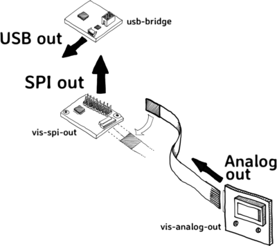

# Dev-kit interfaces

The Chromation dev-kit divides into **three interfaces**:

1. USB out
2. SPI out
3. Analog out



## USB out

*Chromation recommends using the USB interface for initial
evaluation and instrumentation.*

The dev-kit ships ready for USB connection to a computer.


### Windows users enable Load VCP

Windows users connecting the dev-kit for the first time:

- open Device Manager
- locate `USB Serial Converter`, right-click and select
  `Properties`
- on the `Advanced` tab, check the box to `Load VCP`


If `Load VCP` is *not checked*:

- the LabVIEW executable still runs
- but the Python API raises the following exception when it
  attempts to open communication with the dev-kit:

```python
MicroSpecConnectionException: Cannot find CHROMATION device
```

### Python and LabVIEW interfaces

Users communicate with the dev-kit using either:

- Python project `microspec` on PyPI -- *Windows, Mac, Linux*
    - see project here: <https://pypi.org/project/microspec>
    - start using `microspec` now: [jump to PYTHON.md](python/PYTHON.md#setup-microspeclib)
- LabVIEW GUI executable `dev-kit-2020-LabVIEW.exe` -- *Windows only*
    - <https://tinyurl.com/dev-kit-2020-labview>

Chromation recommends using Python to communicate with the
dev-kit. Chromation provides example scripts for using the API, a
command line interface for taking measurements, and a GUI
interface for taking measurements. In addition to the API,
project `microspec` includes tools to help developers interested
in modifying the API to run unit tests, emulate hardware, and
rebuild the documentation. All of Chromation's Python code is
available for free under the standard MIT license.

Chromation provides the LabVIEW GUI but plans to discontinue
using LabVIEW when a stable Python version of the GUI is
released.

## Analog dark correction

The dark signal has two components:

- DC offset
    - this is called *dark-offset* or *voltage-offset* and is
      specified in Volts
    - the offset varies on a per-pixel basis
- AC noise
    - this is called *dark-noise* and is specified as mV RMS
    - *dark-noise* limits precision in measuring the dark-offset

Chromation uses the term *analog dark-correction* to mean
subtracting a single DC offset from the VIDEO signal to use the
full dynamic range of the ADC. In other words, zero photons
*roughly* shows up as a gray value of zero counts. See
[ENOB](DEV-KIT.md#enob) for details on ADC resolution and dynamic
range.

The dev-kit is shipped with dark-correction turned on and
dark-offset trimmed for an average dark of approximately 1.5% of
full-scale (1000 counts out of 65535 counts) at 1ms exposure
time. This setting is usually sufficient to eliminate the need
for subsequent finer dark-correction in software.

For more accurate dark-correction, rotate the trimpot
counterclockwise to subtract *less* of the dark offset. This
reduces the amount of *coarse* dark-correction. Increase the
offset (reduce the coarse dark-correction) until the dark
measurement for all pixels is greater than zero counts in any
single frame of data.

*Fine-tuning the trim pot to get very close to zero counts is
pointless. Using the Chromation dev-kit, there is plenty of extra
dynamic range in the ADC, so it is even fine to turn off the
analog dark-correction completely and do the coarse
dark-correction in software. The advantage of hardware
dark-correction is to reduce the number of measurements and
simplify the software that analyzes the measurements.*

To perform a *fine* dark-correction in software: collect an
average dark measurement for subtracting from illuminated
measurements. See details in [Coarse and Fine
dark-correction](DEV-KIT.md#coarse-and-fine-dark-correction)

### Dark correction hardware in the dev-kit

The pixel voltage from the spectrometer chip, output on pin
`VIDEO`, is dark-offset-corrected using a reference voltage from
the spectrometer chip, output on pin `VREF`:


`VIDEO` changes with each pixel that is clocked out, but `VREF`
outputs a constant voltage (*not* a per-pixel voltage).

`VREF` is an over-estimate of the dark-offset. The trimpot forms
a simple voltage divider that takes a fraction of `VREF` for
doing an analog dark-correction.

The slider switch turns this analog dark-correction on/off. This
is useful when comparing live data against data recorded without
any dark-correction, or when performing all dark-correction in
software.

## SPI out and firmware programming

The dev-kit has two stacked PCBs:


- the bottom PCB is `vis-spi-out`
    - `vis-spi-out` converts the spectrometer chip into a **SPI Slave**
- the top PCB is `usb-bridge`
    - `usb-bridge` converts the SPI interface to a **USB interface**

*The names `usb-bridge` and `vis-spi-out` are used in the PCB
design files and in the firmware respository.*

The connection between the `usb-bridge` and the `vis-spi-out` is
the **16-pin header**:


There are a total of eight signals on this 16-pin header. Five
signals are the SPI interface. The other three signals are Power
(3.3V and 0V) and Reset. These signals also serve as the Flash
memory programming connections from the 6-pin shrouded header on
`usb-bridge`.

### Five-wire SPI

This 16-pin header carries the *five-wire* SPI interface.
Typicaly SPI interfaces only have four signals:

- Master-In Slave-Out (MISO)
- Master-Out Slave-In (MOSI)
- Slave Clock (SCK)
- Slave Select (SS)

The fifth SPI signal is **Data Ready** (DR). This is a Slave
output to indicate to the Master when data is ready. For example,
after the SPI Master commands the SPI Slave to capture a frame (a
spectrum measurement), the SPI Master waits for *Data Ready*
before reading the frame from the SPI Slave.

### All pins duplicated for probing

Each signal is duplicated: eight signals, 16 pins. The pins are
duplicated for two reasons:

1. access to components on `vis-spi-out`
2. probing the SPI bus

#### *Reason 1:* Access `vis-spi-out`

Orientation of `usb-bridge` on `vis-spi-out` does not matter! As
long as the pins line up, it is **impossible** to connect these two
PCBs the wrong way.

The dev-kit ships with the `usb-bridge` PCB directly above the
`vis-spi-out` PCB:


With power off, pull off the `usb-bridge` PCB and reconnect it
rotated (making sure that all 16 pins line up again):


- this gives access to parts on `vis-spi-out` for analog
  dark-correction:
    - the dark-correct trim-pot and on/off slide switch
    - the dark-correct test point
- this also gives access to the two-pin female socket header:
    - modify the firmware to use these two pins as either general
      purpose I/O or I2C communication
    - *coming soon*: Chromation uses these two pins as general
      purpse I/O for control of two LED boards we are adding to
      the dev-kit: a high-CRI white and a broadband NIR
        - jumper wires connect this header to the
          external-control header on the LED boards
        - control the LEDs over USB via the Python interface (or
          over SPI if you are connecting directly to the
          `vis-spi-out` board)

#### *Reason 2:* Probe the SPI bus on a scope or logic analyzer

- with power off:
    - separate the two boards
    - use jumper wires to connect the eight signals between the
      two boards
- probe signals on the duplicate pins

This example shows five jumper wires for SPI and two jumper wires
for power, connecting the `vis-spi-out` and `usb-bridge`. The
`RST` signal is not jumpered because it is only needed during
firmware programming.


The bottom row of spare pins on `vis-spi-out` are the duplicate
pins for probing.

One black jumper wire is shown on the bottom row, leftmost. This
is the duplicate of the `GND` signal on the top row, rightmost.

The jumper wires are female-to-male, for example [Adafruit #1954
](https://www.adafruit.com/product/1954). The female end is
for inserting on the `vis-spi-out` header pins.

### 16-pin header includes the 6 Atmel ISP connections

Six of the eight signals also double as microcontroller Flash
memory programming signals for Atmel's *In-System-Programming*
(ISP):

- 3.3V
- 0V
- Reset
- MISO
- MOSI
- SCK

The `usb-bridge` board has a shrouded ISP header that mates with
the standard Atmel 6-pin, ribbon cable, programming connector.

Use any Atmel AVR programmer. Chromation uses the Atmel-ICE, but
an AVRISP-mkII or any AVRISP-mkII imitator works just as well.

You can program either board (`usb-bridge` or `vis-spi-out`) from
this shrouded 6-pin header on the `ubs-bridge` board. *You do not
need to separate the boards to program the `vis-spi-out` board.*

The slide switches on the `usb-bridge` select normal-mode (SPI)
or programming mode (ISP), and select which board is being
programmed. Details on the slide-switch settings and `make`
commands are in the firmware programming doc.

### Spi Slave configuration and protocol

The SPI Slave configuration (clock polarity and phase) and
command protocol are documented in the [firmware repository in
the SpiMaster.h
header](https://github.com/microspectrometer/dev-kit-2020/blob/master/firmware/lib/src/SpiMaster.h).
Specifically, see the documentation for function
`SpiMasterInit()`.

The SPI Slave follows the protocol defined in `microspec.json` in
Chromation's `microspec` project on PyPI. The JSON file is also
available from the [microspec repository on
GitHub](https://github.com/microspectrometer/microspec/blob/master/cfg/microspec.json).

## Analog out

Analog out is the direct output from the spectrometer chip. 

### Spectrometer chip

In production, the user assembles the spectrometer chip directly
on their PCB.


The package is a 48-pin QFN, but **only nine pins are used**, two
of which are the 0V reference (ground), so there are only eight
signals in total.

The top of the package is an optical die coated in a black
absorber. There is a visible gap or recess at one end of the
optical die. This is where light enters for spectrum
measurements.

This recess/gap feature is also used during PCB assembly to
identify this side of the QFN as the pin 1 side.


### Access chip pins in dev-kit with ZIF connector

The dev-kit spectrometer is mounted on breakout board
`vis-analog-out` for connecting via a zero-insertion-force (ZIF)
connector:


To design a PCB that connects to `vis-analog-out`, use the same
ZIF connector, [Hirose
FH12-8S](https://www.hirose.com/product/p/CL0586-0744-5-55?lang=en#),
or any similar flat-flexible-cable (FFC) connector with 0.5mm
pitch.


### FFC Cables

FFC [Molex#
15166-0078](https://www.mouser.com/ProductDetail/Molex/15166-0078?qs=%2Fha2pyFadujNS7WzWqHtyh439oQ7%2FgvwiEl3Oj%252BwC2qx5jkSJ0bOzw%3D%3D)
connects the two ZIF connectors.

FFC specifications:

- 8-conductors
- 0.5mm-pitch

FFC cables come with the contacts on the same side or opposite
sides. The FFC in the dev-kit has opposite-side contacts so that
the `vis-spi-out` PCB has its ZIF connector on the PCB *top*,
while the `vis-analog-out` (breakout) PCB has its ZIF connector
on the PCB *bottom*. This way the spectrometer chip sits
right-side-up without twisting the FFC.

### Spectrometer Interface PCB

For users that design their own PCB to interface directly with
the spectrometer chip, here is a summary of what `vis-spi-out`
does:

- analog-to-digital (ADC) conversion of the pixel voltages
- digital I/O:
    - configure the chip's internal analog connections
    - control pixel exposure time
    - coordinate pixel readout with the ADC

See the `vis-spi-out` schematic for details.

Also see the `vis-spi-out` firmware source code, in particular:

- `firmware/lib/src/Lis.h`
- `firmware/lib/src/LisConfig.h`
- `firmware/lib/src/LisConfigs.h`

*The name `Lis` refers to the linear photodiode array in the
spectrometer chip.*

## Appendix

### ENOB

Effective Number of Bits (ENOB) is the effective number of bits
of ADC resolution *for the complete system*. The ADC is one part
of this system. The dev-kit uses a 16-bit ADC, but the effective
number of bits is not 16. The limiting factor for ENOB in
spectrometers using CMOS image sensor spectrometers, such as the
Chromation spectrometer, is the image sensor itself.

In qualitative terms, this means that image sensor read noise
well-exceeds the voltage step per ADC bit using a 16-bit ADC.

For reasonable measurement bandwidth, spectrometers using CMOS
image sensors take advantage of 13 effective bits of resolution
at most. The ENOB for the image sensor in Chromation#
`CUVV-45-1-1-1-SMT` is 11 bits.

The limitation is the SNR of the CMOS image sensor. SNR is the
ratio of Vsat to read noise. Vsat is the maximum output swing
minus the offset voltage (offset voltage is sometimes called the
dark offset). Read noise is the AC noise component in the
illuminated signal.

For the CMOS image sensor in `CUVV-45-1-1-1-SMT`:

- Vsat = 1.95V
    - the pixel charge to voltage conversion factor is
      6.5µV/electron
    - voltage at full-well is 3.0e5 electrons x 6.5µV/electron =
      1.95V
    - with a 3.0V maximum swing, expect about 1.05V of offset
      voltage
- read noise = 1.5mV RMS

```
SNR = 1300 (1.95 Vsat / 0.0015 mV RMS)
```

Following the convention in section 6.6 of EMVA1288, express SNR
in dB using `20*log10(SNR)`:

```
SNR = 62.3 dB
```

The dev-kit uses a 1.8V ADC reference, reducing the SNR. There
are two good reasons for doing this:

1. for design simplicity, 1.8V is a standard reference voltage value
2. Vsat does not take into account the linear operating range of
   the pixel
    - linear operating range is *not* 100% of the full-well
      capacity
    - therefore, sacrificing SNR improves spectrometer linearity

Linear range as a percentage of the pixel's full-well capacity is
usually not documented, but for the image sensor in
`CUVV-45-1-1-1-SMT` sensitivity is linear between 5% and 70% of
full-well. The 1.95V value corresponds to 100% full-well. Using a
1.8V ADC reference clamps the maximum gray value (65535 counts)
at 92% of full-well (and then the maximum guaranteed *linear*
gray value is around 50000 counts).

Using 1.8V as the actual Vsat, the ENOB of the image sensor for
this reduced voltage range is:

```
SNR = 1200 (1.8 Vsat / 0.0015 mV RMS)
SNR = 61.6 dB
```

ENOB is calculated as log2(SNR):

```
ENOB = log2(1200) = 10.2 bits
```

Rounding up to the next whole number, this is 11 bits.

To take full advantage of this SNR, therefore, the analog
front-end (ADC, ADC voltage reference, and op-amp buffers) needs
an ENOB in excess of 11 bits.

### Coarse and Fine dark-correction

*Applications do not always need a fine dark-correction step.
This section explains the cost-benefit on implementing fine
dark-correction. Please contact Chromation if you would like more
detail.*

Some image sensor manufacturers call the DC offset a
*dark-offset*, others call it a *voltage-offset*. These are
identical -- it is just the DC offset in the VIDEO signal.

The dark offset only affects dynamic range and SNR to the extent
that it *limits the maximum swing of the VIDEO signal*. This offset
**does not set the noise-floor**. It is a DC value and has
nothing to do with noise.

Noise is time varying. As a single value, it is specified as mV
RMS. Given the usual AWGN assumption about the distribution of
the noise, this RMS value is the *standard deviation* when
looking over many frames of data; when watching raw live data
with very short exposure time, the *peak-to-peak* noise riding on
the signal is about 6x this RMS value (because 99.7% of the
readings are within three standard deviations of the mean value).

*For the Chromation dev-kit, 6x the RMS read-noise is about 328
counts.*

The magnitude of the dark noise and the illuminated noise *are
different*. Manufacturers refer to noise in the illuminated
signal as *read noise*. Use dark noise to determine the image
sensor's dynamic range. Use *read noise* to determine the image
sensor's SNR.

- **dark-offset** is reduced by *subtracting*:
    - the dev-kit ships with a single voltage offset subtracted
      from all pixels
    - for finer dark-correction, determine the remaining average
      dark offset on a per-pixel basis and subtract this offset
      in software
- **dark-noise** is reduced by *filtering*
- filter the dark-noise to *find* the per-pixel dark offsets to
  subtract:
    - to determine the per-pixel values to use in fine
      dark-correction, the dark-signal must be low-pass filtered
      to get a value closer to the "true" DC-offset
    - at long exposure times, the signal is already effectively
      low-pass filtered, at short exposure times it is necessary
      to average frames

For general use cases, such as the qualitative measurements done
in the initial stages of application development, Chromation's
"analog dark-correction" is sufficient. This is a "coarse"
dark-correction. It subtracts the same value from all
measurements.

The dev-kit ships with the dark-correct trim-pot set to a good
default setting for this general use case.

A finer dark-correction step is sometimes necessary when the data
is being scaled (i.e., multiplying the pixel gray values by a
constant or a wavelength-dependent array of values). This need
arises at a further stage of application development where the
measurement setup is known and the goal is to reduce the
measurement error.

The source of error is that the dark signal does not scale with
the illuminated signal. For example, doubling integration time
(roughly) doubles the illuminated signal, but has very little
effect on the dark signal. Therefore, on a pixel-by-pixel basis,
any offset (positive or negative) introduces an additive offset
that throws off calculations where the pixel value is scaled.

Typical examples where applications scale data are:

- normalizing by exposure time
    - scaling all pixels by the integration time to compare two measurements taken at different integration times
- weighting the pixels with spectral irradiance calibration
  coefficients
    - each pixel is weighted by its own coefficient to convert
      gray values to spectral irradiance

Dark-correcting too much or too little introduces the same
magnitude of offset error. Since the "coarse" dark-correction
applies the same offset to all pixels, the best the coarse
dark-correction can achieve is to have some pixels
over-compensated and some under-compensated.

When adding a "fine" dark-correction step, let the "coarse"
dark-correction under-correct all pixels (the dark-data never
falls below zero counts on any pixel). The "fine" dark-correction
then subtracts different offsets on a per-pixel basis to get all
pixels as close as possible to having zero-offset.

Perfect dark-correction is impossible. There is always some
offset error. The goal is just to make this contribution
insignificant compared with other sources of measurement error.

The cost of fine dark correction is that measurements require an
additional dark-correction step: determine the measurement
integration time, collect many frames of dark data, average these
frames, subtract this average from the illuminated measurement.

The number of frames to average depends on the exposure time:
short exposure times require many frames, long exposure times may
not require averaging at all. Ignoring the dependency of the dark
signal on integration time, averaging frames and exposing for
longer integration times have the same effect on the measurement
bandwidth.

So do not start with a magic number like 100 frames to average.
Instead, pick a target measurement bandwidth. For example, say
the target measurement bandwidth is 1 measurement per second and
the application has a bright target measured at 10ms and a much
darker target measured at 100ms. Average 100 frames of dark to
dark-correct the 10ms target and 10 frames of dark to
dark-correct the 100ms target. The measurement bandwidth in both
cases is 1Hz, so both dark measurements filter the same amount of
dark noise.

"Fine" dark-correction only reduces the additive offset caused by
the dark signal. If this error is swamped by other variables,
"fine" dark-correction may not be worth the effort.

The added benefit of the "fine" dark-correction is that it acts
on a pixel-by-pixel basis, as opposed to the "coarse"
dark-correction which subtracts the same offset from all pixels
(regardless of whether coarse dark-correction is done in hardware
or software). Keep in mind that even when scaling data is
required, this "fine" step may not be necessary or worth the
extra effort.

If the extra accuracy of "fine" dark-correction is required, but
collecting dark data is not practical, one solution is to collect
the dark data ahead of time at many integration times, and then
use a look-up table to select the correct dark-correction data.


