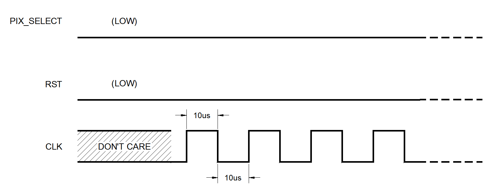
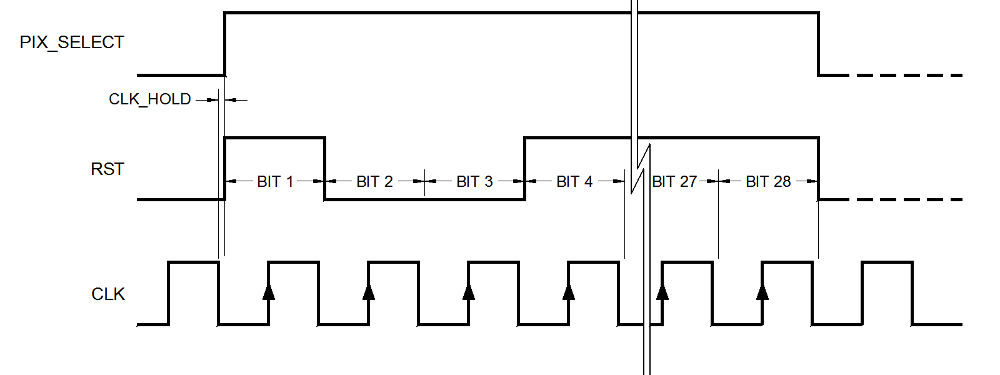
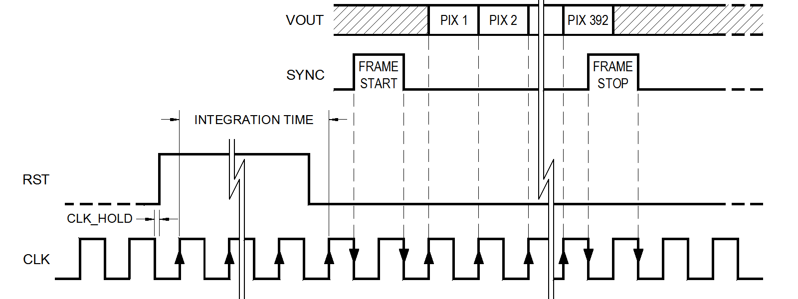
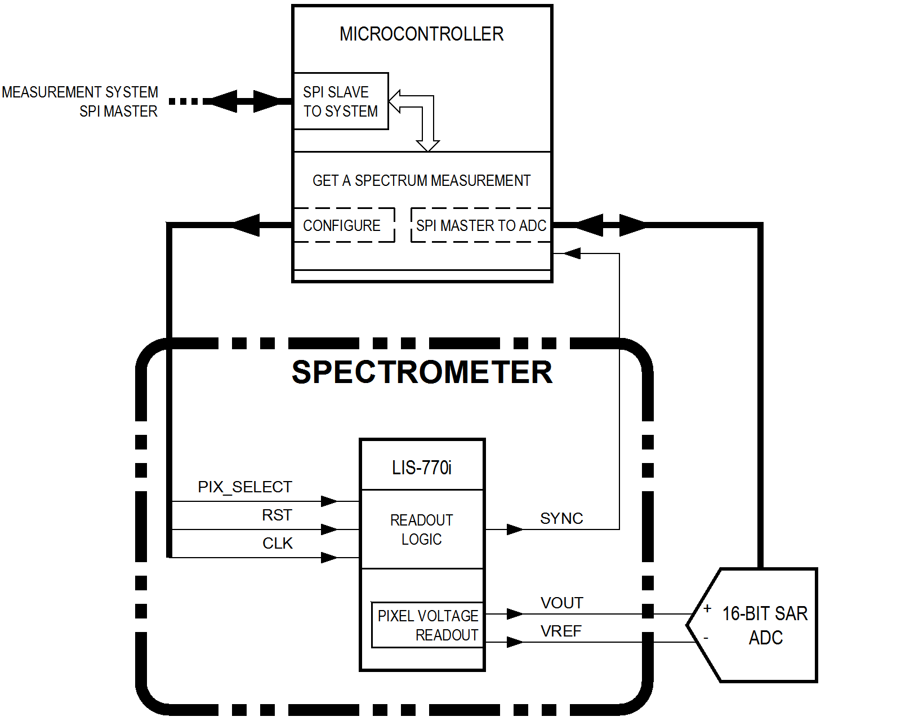
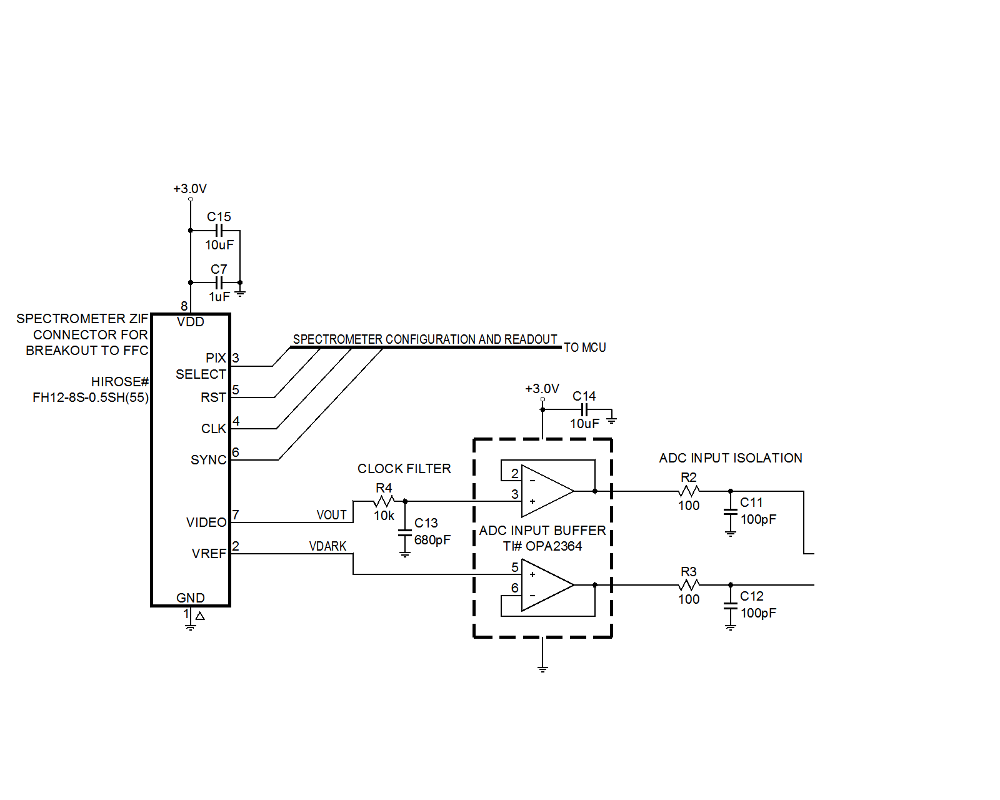

% Chromation Spectrometer Interface
  Information for Preliminary Datasheet
% Mike Gazes
% December 3rd, 2018

# Spectrometer Sequencing Diagrams

# Recommended Operating Conditions
 Symbol         Parameter                                 MIN         TYP   MAX     Units
--------        ----------                               -----       ----- ------- --------
  V~DD~         Supply Voltage                            2.8         3.0   3.3       V
  --            Power Consumption while active            --          5.0   10       mW
  --            Power Consumption in low-power mode       --          30    --       µW
  V~in,HIGH~    Input logic-level **HIGH**                V~DD~-0.7   --    V~DD~     V
  V~in,LOW~     Input logic-level **LOW**                 --          --    0.7       V
  f~CLK~        Clock Frequency                           15          50    200     kHz
  CLK~HOLD~     Clock Hold-time                           --          10    --       ns
  CLK~SETUP~    Clock Setup-time                          --          10    --       ns

Table: Recommended operating conditions

Pins `CLK`, `RST`, and `PIX_SELECT` are logic-level inputs. The spectrometer
samples inputs on the **rising edges** of `CLK`.

*CLK~HOLD~* is the minimum time **after a falling edge of `CLK`** before `RST`
is allowed to change value. *CLK~SETUP~* is the minimum time `RST` must be
stable **before a rising edge of `CLK`** to guarantee its value is sampled on the
clock rising edge.

# Electrical Characteristics
Parameter                   Condition                           MIN   TYP       MAX     Units
----------                  ----------                          ----- -----     -----   -------
V~OUT~ output impedance     --                                  --    10        --      kΩ
V~OUT~ settling time        --                                  --    1         --      µs
V~OUT~ maximum swing        2.5x gain                           --    V~DD~-0.3 --      V
V~OUT~ at dark              no light                            0.60  0.84      1.1     V
Full well                   pixels: 312.5um tall, 15.6um pitch  --    3.0e5     --      electrons
Linearity error per pixel   1x gain, V~OUT~=5%-70% full-well    0.5   1         5       %~error~
Conversion efficiency       pixels: 312.5um tall                --    6.5       --      µV/electron
Image lag                   --                                  0.1   0.3       3.0     %V~SAT~

Table: Electrical characteristics relevant to analog signal conditioning and ADC
component selection

*Linearity error per pixel* is quantified by measuring the mean gray value
(digital counts) at several voltages from V~OUT~ = 5% of full-well to V~OUT~ =
70% of full-well, finding the least-squares fit to a straight-line, and
reporting the greatest percentage error between the measured values and the
straight-line fit. The ideal is 0% error, indicating that an increase in the
amount of photons incident on the pixel active area causes a linearly
proportional increase in the dark-corrected output voltage.

*Full well* is the number of electrons a pixel stores at the saturation voltage.
The saturation voltage, V~SAT~, is the product of the *full well* and the
*conversion efficiency*. When configured for 15.6um-pitch, therefore, V~SAT~
is 1.95V and 70% of V~SAT~ is 1.365V.

Chromation recommends dark-correcting the analog output before input to the ADC
and selecting an ADC voltage reference between 70% and 100% of V~SAT~. Of
course, V~SAT~ and 70% of V~SAT~ do not correspond to standard voltage reference
values. Voltage reference selection depends on application-specific design
considerations.

# Recommended ADC values
TODO: change this section based on new info re: resolution,
vref, and offset subtraction

- resolution
    - 11-bits is the max useful resolution given dynamic range limits
      of the detector itself, but the kit uses 16-bits
    - do not express resolution as a min/max/typ type parameter
    - see /cygdrive/c/chromation-dropbox/Dropbox/ChromationBD/customers/DistributedSensingTechnology/enob.md
- vref
    - changed from 2.048V to 1.8V
    - this makes sense as a min/max/typ parameter
    - use 2.048V as the max, 1.8V as the typical
- also discuss how the offset is subtracted with the trimpot

Chromation uses a 16-bit SAR ADC and 2.048V reference in the Chromation
Spectrometer Evaluation Kit. The voltage reference value is based on the
Chromation recommendations for linear pixel array configuration and analog
dark-correction. See the reference design for the specific part numbers used in
the Chromation Spectrometer Evaluation Kit.

Parameter           MIN    TYP   MAX   Units
----------         -----  ----- ----- -------
Resolution          10      16  --      bits
Voltage reference   1.25   1.8  2.048    V

Table: Recommended ADC configuration for the spectrometer interface

# Recommended Clock Filter

The rising edge of the clock signal couples into the V~OUT~ signal. Filter this
transient with a simple passive RC filter with f~3dB~ ≥ $\frac{1}{2}$f~CLK~.
This filter is not essential so it is safe to eliminate on ultra-low
component-count designs. The table below shows recommended values.

 Symbol   Parameter                     Condition      MIN                 TYP       MAX    Units
--------  ----------                    ----------    -----               -----     -----  -------
  f~3dB~  Clock filter cutoff frequency --            $\frac{1}{2}$f~CLK~   --       --     kHz
  R~filt~ Clock filter R                f~CLK~=50kHz   --                   10       --     kΩ
  C~filt~ Clock filter C                f~CLK~=50kHz   --                  680       --     pF

Table: Recommended spectrometer V~OUT~ passive RC clock filter

# Spectrometer Configuration During Wavelength Calibration
Parameter               MIN   TYP    MAX     Units
----------             ----- -----  -----   -------
Integration time       1       10   1000     ms
Internal analog gain   --      1x   --       --
Pixel height           --     312.5 --       um
Pixel pitch            --     15.6  --       um

Table: Spectrometer configuration used during wavelength calibration

# Spectrometer Interface
The following describes how to interface the Chromation spectrometer, to:

- work **directly with the pixel array** in the spectrometer
- or to use the **dev-kit** readout circuit as a digital interface:
    - **`USB-out`**: both circuit boards, as shipped
    - **`SPI-out`**: remove the top circuit board and use the jumper wires to
      connect to the `SPI` header pins

## Open-source repository of design files
The **dev-kit** is open-source. Design files are available from our online
repository:

- EAGLE circuit schematics
- EAGLE circuit board files
- firmware
- Python libraries and applications

After reading this documentation, we encourage you to clone the repository and
use/modify our design files for your project. These are our latest stable design
files we use internally for dev kit production and for our own characterization
and R&D.

We welcome feedback and fixes/improvements. We are not liable for any damages
caused by using our design files.

## Linear pixel array
The linear pixel array in the spectrometer is Dynamax# `LIS-770i`. Interfacing
the pixel array is greatly simplified by the dev-kit digital interface:

- pixel configuration details are excluded because the `SPI-out` interface
  defaults to the optimal settings for our spectrometer:
    - active pixels: all
    - pixel height: largest
    - pixel pitch: largest
    - pixel voltage gain: smallest (1x)
- data acquisition details are encapsulated in higher-level functions provided
  by the `SPI-out` interface:
    - set exposure time (a.k.a integration time)
    - acquire a spectrum
    - auto-expose

See the `LIS-770i` datasheet for additional operating conditions, waveforms, and
details about other functionality not covered here, in particular the
`power-down` mode.

## Spectrometer Interface Block Diagram
The block diagram below shows the spectrometer signals referred to in the
following sequences to initialize, configure, and acquire a spectrum. The block
diagram also shows how the **spectrometer digital interface** converts the
spectrometer to a *SPI slave* device.

The purpose of the **spectrometer digital interface** is to hide the operational
details of the `LIS-770i` and ADC, and instead provide the measurement system
with a standard interface. Chromation recommends presenting the spectrometer
interface to upstream devices as a *SPI slave*. A *SPI master* in the upstream
measurement system executes requests from the system host application by writing
high-level commands recognized by the *SPI slave*.

## Initialize the spectrometer after power-up
The following sequence shows the recommended input logic-levels to apply after
power-on. Start the clock signal on `CLK` after `PIX_SELECT` and `RST` are
driven **LOW**.

- drive `PIX_SELECT` **LOW**
    - `PIX_SELECT` idles **LOW**
- drive `RST` **LOW**
    - `RST` idles **LOW**
- drive `CLK` with a 50kHz PWM, 50% duty cycle
    - the choice of clock speed is determined by the ADC conversion settling
      time and the speed of communication with the ADC
    - 50kHz is slow enough for a 16-bit SAR ADC to convert pixel
      voltages and to read out the converted digital value

## Configure the spectrometer

The spectrometer's linear pixel array has configurable parameters:

- analog gain: 1x, 2.5x, 4x, 5x
- pixel height: 62.5um, 125um, 187.5um, 250um, 312.5um
- pixel pitch: 7.8um (array is 784 pixels), 15.6um (array is 392 pixels)

The linear pixel array does *not* have a known default configuration on
power-up. At a minimum, these parameters must be hard-coded in firmware and the
linear pixel array must be programmed each time the device is powered-up.

Making these parameters configurable by the upstream measurement system may be
beneficial in some context, particularly the analog gain. The spectrometer
performance specifications only apply for the configuration intended by
Chromation. This configuration matches the optical design of the Chromation
spectrometer.

This is the intended configuration:

- analog gain: 1x
- pixel height: 312.5um
- pixel pitch: 15.6um (the array contains 392 pixels)

The following programming sequence configures the parameters of the linear pixel
array parameters to match the intended configuration. The programming sequence
consists of shifting in 28 bits. Bits are shifted in on the rising edge of
`CLK`. The sequence starts with bit 1 and ends with bit 28.

- start the programming sequence:
    - drive `PIX_SELECT` **HIGH** on a falling edge of `CLK`
- bit 1 **HIGH** programs the pixel pitch for 15.6um
    - drive `RST` **HIGH**
    - wait for the next falling edge of `CLK`
- bits 2 and 3 **LOW** set the analog gain to 1x
    - drive `RST` **LOW**
    - wait for the next falling edge of `CLK`
    - drive `RST` **LOW**
    - wait for the next falling edge of `CLK`
- the next 25 bits are **HIGH** to select the 312.5um pixel height
    - drive `RST` **HIGH**
    - wait for the next falling edge of `CLK`
    - repeat 24 more times
- stop the programming sequence:
    - drive `RST` **LOW**
    - drive `PIX_SELECT` **LOW**

## Acquire a spectrum

The linear pixel array has internal switching logic to execute the spectrometer
**exposure** and **readout** sequence, but like most other linear pixel arrays,
the `LIS-770i` requires external logic-level signals to drive this internal
switching. The `LIS-770i` also requires an external ADC to convert its analog
output.

### Expose the spectrometer pixels
- drive `RST` **HIGH** to start exposure
    - drive `RST` **HIGH** after a falling edge of `CLK`
    - pixel exposure starts when the **HIGH** on `RST` is sampled on the rising
      edge of `CLK`
- wait the desired integration time by counting falling edges of `CLK`
    - for a 50kHz `CLK`, falling edges represent 20µs ticks
    - for example, waiting 500 ticks is a 10ms integration time
- drive `RST` **LOW** to stop exposure
    - again, the **LOW** is sampled on the next rising edge of `CLK`

### Immediately readout the pixel voltages
- wait for a pulse on `SYNC`:
    - after `RST` is driven **LOW**, spectrometer output pin `SYNC` goes **HIGH** on
      the next falling edge of `CLK`
    - `SYNC` goes **LOW** on the next falling edge of `CLK` (`SYNC` is **HIGH** for
      one clock period)
- pixel readout begins on the next rising `CLK` edge after `SYNC` goes **LOW**
- start each ADC conversion on each rising edge of `CLK`
- finish each ADC conversion before the falling edge of `CLK`
    - the falling edge of `CLK` may couple into the pixel output voltage, so it
      is preferable to finish the ADC conversion before the `CLK` falling edge
    - and it is good practice in general to avoid transients during an ADC
      conversion
    - this is easily achieved using a 50kHz clock
    - in fact, using *Linear Technology #LTC1864L* as the ADC, both the
      conversion and readout of the converted samples fits within the `CLK` high
      time
- on the last pixel readout, `SYNC` pulses **HIGH** again for one clock period,
  starting on the falling edge of `CLK`

# Reference Design
This is the spectrometer interface in the Chromation Spectrometer Evaluation
Kit.

