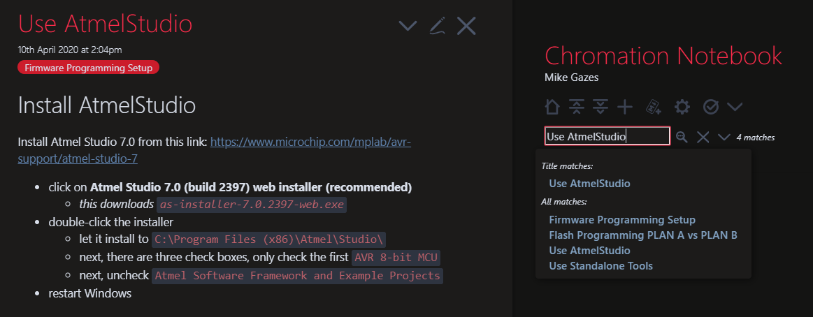

# Chromation dev-kit firmware

`firmware` consists of C source files and build scripts. The
build scripts are for two targets:

- the microcontroller target -- this outputs AVR assembly `.elf`
- the unit-test target -- this outputs an executable that runs
  from a command line on the development computer

## Firmware documentation

The firmware is documented with Doxygen. View the Doxygen in
[`firmware/doxygen/html/index.html`](firmware/doxygen/html/index.html).
Navigate the project by clicking on `Files` on the top of the
screen, then either:

- click `File List` to browse the project by file
- click `Globals` then `All` to view an index of all global
  `Variables` and all `Functions`

### Firmware organization

The `File List` shows three folders:

- `lib`
    - contains general libraries used by both PCBs
- `usb-bridge`
    - firmware specific to the `usb-bridge` pcb
    - `main()` is in `src/usb-bridge.c`
- `vis-spi-out`
    - firmware specific to the `vis-spi-out` pcb
    - `main()` is in `src/vis-spi-out.c`

### Firmware conventions

Function names starting with underscore (`_`) are low-level, used
only within the function's library.

Function docstrings start with a quick description of what the
function does, followed by a bullet-list of specific behaviors
that is auto-generated by the unit tests.

Breaking with C convention, most of the library functions are
defined in `.h` files, with the function signatures declared in
the `.c` file. This enables the compiler to inline functions
declared `inline`.

Most library functions are `inline`. This is a necessity on this
project because the microcontroller clock is only 10MHz. The code
does not execute quickly enough if the compiler does not use fast
I/O assembly instructions when possible.

To use these fast instructions, the compiler must know register
and bit values at compile-time. It is too late to wait until
linking the object files into the final executable. Object files
generated without these values are forced to use the much slower,
generic load and store instructions.

This break with convention only has one real drawback. It
complicates faking functions for testing.

### Unit tests

[ ] Add documentation for firmware unit tests.

## File list

```
firmware
├── README.md
├── common.mk -- Makefile common to `vis-spi-out` and `usb-bridge`
├── Doxyfile -- Doxygen settings for firmware documentation
├── lib
│   ├── build
│   ├── Makefile
│   ├── src
│   └── test
├── usb-bridge
│   ├── build
│   ├── Makefile
│   ├── src
│   └── test
└── vis-spi-out
    ├── build
    ├── Makefile
    ├── src
    └── test
```

`firmware` also contains shell scripts and help messages for
programming the EEPROM in the FTDI chip on the `usb-bridge` PCB,
probably of no interest to most users:

```
firmware
├── Makefile
├── help.man -- Help msg printed when running `make` with no args
├── help-setup.man -- Help msg to setup firmware toolchain
├── help-board-common.man -- Help msg for `make` from board folder with no args
├── help-build.man -- Help msg for build from source
├── help-flash.man -- Help msg for programming Flash memory
├── help-ftdi.man -- Help msg for programming FTDI EEPROM
├── help-fuses.man -- Help msg for programming MCU AVR fuses
├── devcnt.sh -- bash script to parse temporary file `devscan`
├── ftcfg.xml -- Template config for FTDI EEPROM
├── kitnum.py -- Python script to generate new serial numbers
├── kitnum.sh -- bash script CLI to generate XML for new serial numbers
├── progkitnum.sh -- bash script to write the FTDI EEPROM
├── uservars.mk -- manually set path to ATmega DFP (Device Family Pack)
├── kits -- Kit data, sorted by serial number
│   ├── 0911-03 -- example kit serial number
│   ├── ...
│   ...
...
└── writexml.py -- create custom config from XML template
```

# Dev-kit Flash memory programming

## Overview

Use `make` to program:

- the FTDI FT221X EEPROM
    - the kit serial number
    - configuration for how the USB Bridge IC behaves
- the two ATmega328 microcontrollers
    - Flash memory
    - fuses

First time setup of a dev kit requires:

- two `make` commands for the FTDI chip
    - `$ make kitnum`
    - `$ make progkitnum`
- two `make` commands for each microcontroller.
    - `$ make fuses`
    - `$ make flash`

Once a kit has been programmed, updating firmware is just
the Flash:

- `$ make flash`

## Enter the repo

Open bash (the Cygwin mintty terminal):

```powershell
> bash
```

Enter the local directory for this repo

```bash
$ cd ~/chromation/dev-kit-2020/
```

Enter the `firmware` folder

```bash
$ cd firmware/
```

## Program the EEPROM

Hardware setup:

- connect the dev-kit over USB
- if AtmelICE is connected, power it OFF

Check the dev-kit is visible:

```bash
$ make scan
Scanning connected USB devices...
Device 0: FT X Series, ChromationSpect-0911-03, CHROMATION091103
OK: One device found.
```

Program the serial number and configure the FTDI EEPROM:

```bash
$ make kitnum

Serial number: 1182-XX
Enter two digits to replace XX
...
```

*`make kitnum` creates a sub-folder in `kits/` and the EEPROM
config file for this kit*

```bash
$ make progkitnum
...
Enter ENTIRE kit serial number, for example: 1182-01
XXXX-XX: 1182-03
...
```

## Program the fuses and the Flash

- connect the *Atmel-ICE* programmer over USB and ISP
- flip the switches to program the `usb-bridge`
    - slide black switch ''left''
    - slide white switch ''right''

Program the usb-bridge microcontroller:

```bash
$ cd usb-bridge/
$ make fuses

atprogram.exe --tool atmelice --interface isp --device atmega328p \
        write --verify --fuses --values F7D9FF
Firmware check OK
Verification of write OK
Write completed successfully.

$ make flash

atprogram.exe --tool atmelice --interface isp \
        --device atmega328p program --chiperase --verify --file build/usb-bridge.elf
Firmware check OK
Programming and verification completed successfully.
avr-size build/usb-bridge.elf
   text    data     bss     dec     hex filename
   2980      96    1577    4653    122d build/usb-bridge.elf
```

Hardware setup:

- flip the switches to program the `vis-spi-out`
    - slide white switch ''left''

Program the vis-spi-out microcontroller:

```bash
$ cd ../vis-spi-out/

$ make fuses

atprogram.exe --tool atmelice --interface isp --device atmega328p \
        write --verify --fuses --values F7D9FF
Firmware check OK
Verification of write OK
Write completed successfully.

$ make flash

atprogram.exe --tool atmelice --interface isp \
        --device atmega328p program --chiperase --verify --file build/vis-spi-out.elf
Firmware check OK
Programming and verification completed successfully.
avr-size build/vis-spi-out.elf
   text    data     bss     dec     hex filename
   3754     352    1577    5683    1633 build/vis-spi-out.elf
```

For first time setup, see the **Setup instructions** below.

# Dev-kit programming setup

:rainbow: See the
[TiddlyWiki](https://microspectrometer.github.io/flash-avr-firmware/)
for instructions to setup the firmware (Flash/EEPROM) programming
toolchain.

Open tiddler **Use AtmelStudio**:



* type *Use AtmelStudio* in the search bar on the right
* click on the link **Use AtmelStudio** in the search results
* the tiddler opens on the left, as shown

The tiddler contains links to external websites to download tools
and links to other tiddlers in the TiddlyWiki.
