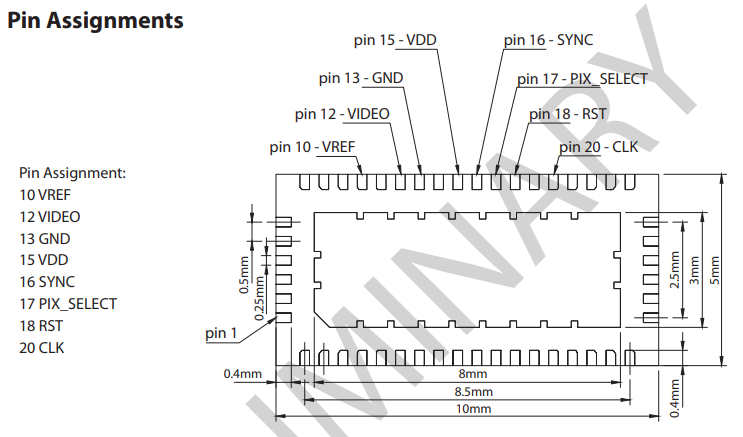

# Design notes for vis-analog-out

# CUVV-45-1-1-1-SMT pinout

## Most of the pins on the QFN-48 are not used

The linear photodiode array IC in CUVV-45-1-1-1-SMT only has
eight pads, but the CUVV-45-1-1-1-SMT package is a QFN-48.

Nine of the 48 pads are used: the eight that connect to the
photodiode array, plus a ninth pad labeled `SHLD` (short for
"electrostatic shield") that connects to the leadframe of the
QFN-48.

## Tie `SHLD` to `GND`

`SHLD` is pin 14, right next to `GND` on pin 13. `SHLD` is not
shown in the above *pin assignment* drawing.

Connect the QFN-48 leadframe to the 0V reference (i.e., connect
pins 13 and 14) and, if possible, tie the 0V reference to a
copper plane on the PCB.

### Intent of shielding

This creates a pair of conductor planes (the PCB copper plane and
the QFN-48 leadframe) with both planes held at the same
potential. This configuration helps reduce coupling of electrical
noise into the charge amplifier circuitry of the photodiode array
by preventing electrostatic coupling from *below* the
spectrometer chip.

# Breakout board mounting

The breakout board is designed to press-fit into a laser-cut
slot. This is how Chromation ships the breakout board in the
dev-kit.

Alternatively, the PCB has two holes for fastening to a housing.

# FFC

## Use FFC with opposite-side contacts

The ZIF connect on `vis-analog-out` is wired for connecting to
the ZIF on `vis-spi-out` using a flat-flex cable with
*opposite-side* contacts.

- `vis-spi-out` ZIF is mounted on the PCB top-side (the component
  side)
- `vis-analog-out` has CUVV-45-1-1-1-SMT on the top-side and ZIF
  on the bottom side
- an FFC with opposite-side contacts connects these two boards so
  that the CUVV-45-1-1-1-SMT sits face-up

## FFC specs and general info

- FFC part number is [Molex# 151660078](https://www.molex.com/molex/products/part-detail/cable/0151660078) available from [Mouser# 538-15166-0078](https://www.mouser.com/productdetail/molex/15166-0078?qs=N2VrfF4LzQfpdYEI7OsWCw%3D%3D)
    - 76mm long
    - 8 circuits
    - 0.5mm-pitch
    - opposite-side contacts
    - manufactured by Molex
- learn more about FFC on [the Molex
  website](https://www.molex.com/molex/products/family/premoflex)

