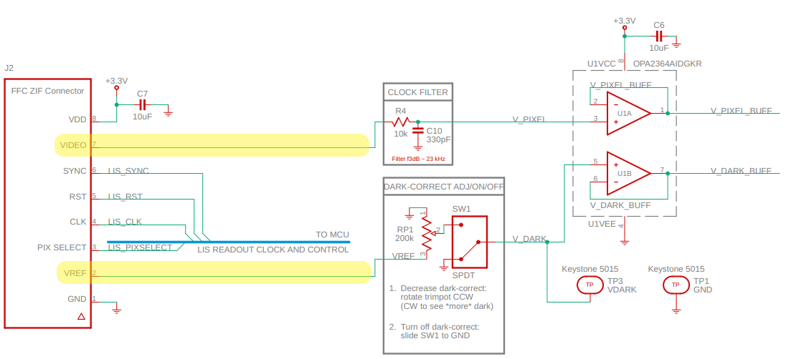

# Design notes for vis-spi-out

This is not an explanation of the design, just documentation on
some design decisions.

# Power

- power all parts on single +3.3V supply
- +3.3V from voltage regulator on `usb-bridge`

# ADC

## ADC Voltage reference

- ADC voltage reference is 1.8V
    - TI# LM4132AMF-1.8/NOPB
- 1.8V is a compromise between linearity and dynamic range

### Linearity

- detector manufacturer guarantees linear response from 5% to 70%
  of full-well
- voltage at full-well capacity:
    - 3e5 electrons x 6.5µV/electron = 1.95V
    - this is 100% full-well
- 70% full-well is 1.365V
- (1.365/1.8) x (2^16-1) = 49697 counts
- 1.8V is 92% full-well
- from 49697 counts to 65535 counts (1.365V to 1.8V), the
  response is not guaranteed to be linear
- if not linear, the response is soft-saturated
- Chromation has not characterized this behavior, but
  qualitatively we have not observed any distortion

### Dynamic range

- the tradeoff is that lowering the ADC voltage reference also
  decreases dynamic range, defined as the ratio of the largest
  output voltage to the output voltage where SNR=1

### No hard-clipping below full-scale

- the response is guaranteed not to hard-clip below full-scale
  (65535 counts)
    - the full-swing voltage of VIDEO is 3.0V:
        - the 3.3V rail minus 0.3V
    - this swing includes the offset voltage
    - maximum offset voltage is 1.1V, typical is 0.84V
    - adding the maximum offset voltage to the 1.8V ADC voltage
      reference, the total is 2.9V
    - 2.9V is 100mV below the 3.0V where hard-clipping occurs
    - therefore, a full-scale 1.8V output should never hard-clip
      below full-scale

### Package
- Device `LM4132AMF-1.8/NOPB`
    - Package Type `SOT-23`
    - Package Drawing `DBV`
    - Pins `5`

### Circuit Connections
- tie `EN` pin to `VIN` pin
- use two capacitors: CIN and COUT
    - satisfy: CIN >= COUT and COUT < 10 µF
    - make CIN 10 µF and COUT 1 µF

# Dark-correction

## Overview

The dark signal has two components: a DC offset called
*dark-offset* and an AC component called *dark-noise*.

- dark-offset is reduced by subtracting:
    - determine the average dark offset on a per-pixel basis
    - subtract these per-pixel offsets from the illuminated
      measurement
- dark-noise is reduced by filtering:
    - filtering decreases the measurement bandwidth
    - filter by:
        - averaging frames
        - using longer exposure times

The goal of dark correction is to eliminate the dark signal prior
to subsequent data processing for radiometric analysis (i.e.,
comparing spectral power across wavelengths and/or across
measurements). Even in applications that are pure wavelength
detection, eliminating the dark signal is desirable because it
improves dynamic range.

The pixel voltage from the spectrometer chip, output on pin
`VIDEO`, is dark-offset-corrected using a reference voltage from
the spectrometer chip, output on pin `VREF`:

`VIDEO` changes with each pixel that is clocked out, but `VREF`
outputs a constant voltage (*not* a per-pixel voltage).

`VREF` is a slight over-estimate of the dark-offset. The trimpot
forms a simple voltage divider that takes a fraction of `VREF`
for doing an analog dark-correction. The slider switch turns this
analog dark-correction on/off.

The dev-kit is shipped with dark-correction turned on and
dark-offset trimmed for an average dark of approximately 1.5% of
full-scale (1000 counts out of 65535 counts) at 1ms exposure
time. This setting is usually sufficient to eliminate the need
for subsequent dark-correction.

For users that need more accurate dark-correction, rotate the
trimpot counterclockwise to subtract less of the dark offset.
This uses the analog dark-correct as a *coarse* dark-correction.
Perform the final *fine* dark-correction in software the usual
way: collect a dark measurement for subtracting from the
illuminated measurement.

## dark-correct trimpot design notes

- VREF analog output impedance is `10 kΩ`
- a 200 kΩ pot yields at most 95% of `VREF`
- layout: do not route traces *under* the pot
    - would rely on the soldermask as an insulator
    - the turn on the trimpot is metal, electrically connected to the wiper
    - the underside of the trim is *also* metal, also connected (the turn
      mechanism is a single piece)
- it is OK to attach the pot directly to LIS-770i pin `VREF`:
    - pot slightly loads `VREF`:
        - the pot still has 95% of the `VREF` voltage across it
- pot goes *before* the op-amp buffer
    - op-amp inputs should have no problem avoiding loading even
      the worst-case ouput impedance of this trimmed `VREF`
      signal
    - worst-case is with pot about midway
    - then output impedance of trimmed `VREF` is about 100 kΩ
- even if `VREF` output impedance with pot were somehow the full
  200 kΩ of the pot, what is the op-amp input impedance?
    - op-amp is `TI# OPA2364`
    - input bias current is 10 pA
    - 10 pA is insignificant:
        - (V/kΩ) = mA
        - mA * 1.0e6 = pA
        - (V/kΩ)*1.0e6 = pA
        - 0.5 / 200 * 1.0e6 = 2500.0 pA

## dark-correct on/off switch design notes

- slide switch for customers to turn dark-correction on/off
  without touching the trimpot
- switch connects `VDARK` to `GND` instead of pot wiper
